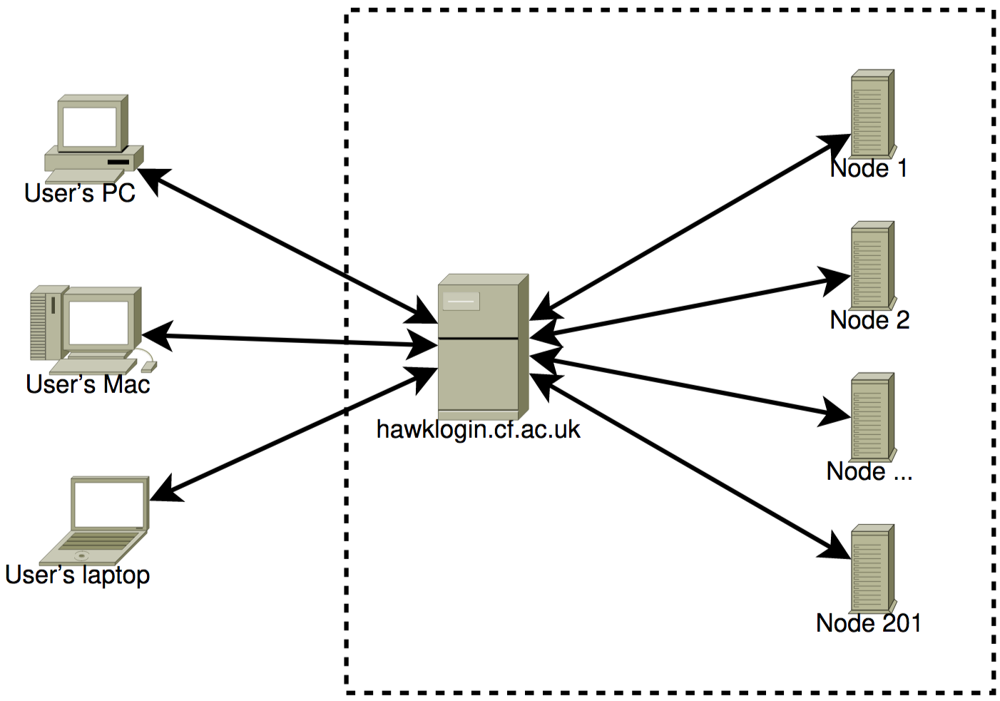

# ICE 4131 High Performance Computing - Lab 2

**Tutor:** Peter Butcher ([p.butcher@bangor.ac.uk](p.butcher@bangor.ac.uk))

**Lab Assistants**:

- Iwan Mitchell ([i.t.mitchell@bangor.ac.uk](i.t.mitchell@bangor.ac.uk))
- Frank Williams ([f.j.williams@bangor.ac.uk](f.j.williams@bangor.ac.uk))

### Objectives

_**NOTE:** If you have not completed the tasks from [Lab 1](../lab1/README.md), you should complete those first!_

Today’s lab will introduce you to [SLURM](https://slurm.schedmd.com/documentation.html) (Simple Linux Utility for Resource Management), a free and open-source job scheduler for Linux and Unix-like operating systems. It is mainly used by supercomputers and computer clusters. In today's lab, you will learn how to use it to submit your work to Supercomputing Wales' supercomputer: https://supercomputing.wales

### Task List

Today's tasks are as follows:

1. SCW Topology
2. Creating a job
3. Run your code from lab 1 on the supercomputer
4. Working with remote files locally

---

## STEP 1: SCW Topology

So far you have executed your programs using `./PROGRAM_NAME`, e.g.:

```bash
./helloworld
```

The overall topology of the supercomputer looks like:



It is not good practice to run your code on the login server when using a supercomputer. This is because the execution will be performed on `hawklogin.cf.ac.uk` directly, rather than on one of the compute nodes you can see on the diagram above. **All** users that are currently logged in are using `hawklogin.cf.ac.uk`, sharing its resources, so every time you run a program there, you are using resources that could be used by other users as they log in. Running large jobs on the login server can deny some users from even accessing the sueprcomputer completely.

It is therefore better to use [SLURM](https://slurm.schedmd.com/documentation.html) to make sure your code is running on a dedicated compute node rather than a shared resource. This way you can maximise performance, and you won't annoy other users.

### `sinfo`

The `sinfo` commend lists the partitions that are available to you. A partition is a set of compute nodes (computers dedicated to... computing), grouped logically. Typical examples include partitions dedicated to batch processing, debugging, post processing, or visualization. Try to run the `sinfo` command and see if you can work out what this readout does.

Expected output is similar to:

```bash
PARTITION AVAIL  TIMELIMIT  NODES  STATE NODELIST
compute*     up 3-00:00:00      9    mix ccs[0120,0122,0126,0129-0130,0132-0133,1010,1018]
compute*     up 3-00:00:00    141  alloc ccs[0001-0119,0121,0123-0125,0127-0128,0134,1009,1011-1017,1019-1022,1024-1026]
compute*     up 3-00:00:00      2   idle ccs[0131,1023]
highmem      up 3-00:00:00      2    mix ccs[1010,1018]
highmem      up 3-00:00:00     23  alloc ccs[1001-1009,1011-1017,1019-1022,1024-1026]
highmem      up 3-00:00:00      1   idle ccs1023
gpu          up 2-00:00:00      3    mix ccs[2003,2010-2011]
gpu          up 2-00:00:00     10  alloc ccs[2001-2002,2004-2009,2012-2013]
htc          up 3-00:00:00     15    mix ccs[0120,0122,0126,0129-0130,0132-0133,1010,1018,2010-2011,3004,3012,3015,3024]
htc          up 3-00:00:00     48  alloc ccs[0121,0123-0125,0127-0128,0134,1009,1011-1017,1019-1022,1024-1026,2008-2009,2012-2013,3001-3003,3005-3011,3013-3014,3016-3023,3025-3026]
htc          up 3-00:00:00      2   idle ccs[0131,1023]
dev          up    1:00:00      1    mix ccs0135
dev          up    1:00:00      1  alloc ccs0136
```

The comamnd `sinfo` can output the information in a node-oriented fashio, with the argument `-N -l`. Try them:

```bash
sinfo -N -l
```

Expected output is similar to:

```bash
Thu Oct 17 11:55:05 2019
NODELIST   NODES PARTITION       STATE CPUS    S:C:T MEMORY TMP_DISK WEIGHT AVAIL_FE REASON
ccs0001        1  compute*   allocated   40   2:20:1 191000        0      1   (null) none
ccs0002        1  compute*   allocated   40   2:20:1 191000        0      1   (null) none
ccs0003        1  compute*   allocated   40   2:20:1 191000        0      1   (null) none
...
...
ccs0118        1  compute*   allocated   40   2:20:1 191000        0      1   (null) none
ccs0119        1  compute*   allocated   40   2:20:1 191000        0      1   (null) none
ccs0120        1       htc       mixed   40   2:20:1 191000        0      1   (null) none
ccs0120        1  compute*       mixed   40   2:20:1 191000        0      1   (null) none
ccs0121        1       htc   allocated   40   2:20:1 191000        0      1   (null) none
...
...
ccs1008        1   highmem   allocated   40   2:20:1 383000        0      1   (null) none
ccs1009        1   highmem   allocated   40   2:20:1 383000        0      1   (null) none
...
...
ccs2001        1       gpu   allocated   40   2:20:1 383000        0      1   (null) none
ccs2002        1       gpu   allocated   40   2:20:1 383000        0      1   (null) none
```

### `squeue`

The `squeue` comamnd shows the list of jobs that are currently running, these are either:

- Running, denoted as `R`
- Waiting for resources, denoted as `PD`

Try it:

```bash
squeue
```

You should see all the current jobs. In most cases, you are only interested in yours. You can add the following to the `squeue` command to list just your jobs: `-u $USER`. The `-u` flag takes one argument, a username, and `$USER` reads your username from an environment variable to save you typing it out yourself, try it:

```bash
squeue -u $USER
```

Expected output is similar to:

```bash
JOBID PARTITION     NAME     USER ST       TIME  NODES NODELIST(REASON)
7364890      work     test ptb18xhf PD       0:00      1 (None)
7364888      work     test ptb18xhf  R       0:02      1 bwc053
7364889      work     test ptb18xhf  R       0:02      1 bwc053
$
```

---

## STEP 2: Creating a job

A job consists of two things:

1. **Resource requests**, which consist of a number of CPUs, the expected duration of computation and the amount of required RAM or disk space etc.
2. **Job steps** describe the tasks that must be done, softwre which must be run.

It's time to creatre a job.

Ensure you are in your home directory with `cd ~`. This is a shortcut to navigating to the root of your working directory on the supercomputer, also known as 'home'.

Create a new directory in your home directory called `lab2` using the `mkdir` command.
Go into that directory using the `cd` command. Use `nano` to create a file named `submit.sh`:

```bash
nano submit.sh
```

The file should contain the following:

```bash
#!/bin/bash
#
#SBATCH --job-name=my_test           # Job name
#SBATCH --account=scw2139            # SCW project code
#SBATCH --ntasks=1                   # Run a single task
#SBATCH --mem=600mb                  # Total memory limit
#SBATCH --time=00:15:00              # Time limit hrs:min:sec

echo HOSTNAME:
hostname

echo CONTENTS OF HOME DIRECTORY:
ls $HOME

echo WAIT 15 SECONDS
sleep 15s

echo EXIT
```

This short program sets up a batch job on the supercomputer, prints the hostname and the contents of your home directory to the terminal window, then sleeps for 15s before exiting.

> **PRO TIP:**  
> If you don't want to remember the project code `scw2139` each time, modify the file `.bashrc` in your home directory and add the following line:
>
> ```bash
> export PROJECT=scw2139
> ```
>
> After saving, run the `bash` command. Now the environment variable `$project` is available every time you need to refer to the SCW project code. If you follow this step, you can replace line 4 of `submit.sh` with:
>
> ```bash
> #SBATCH --account=$PROJECT
> ```

Before you launch your job, type:

```bash
export SCW_TPN_OVERRIDE=1
```

This is because we are only using 1 thread in this case.

To launch your first job, you need to use `sbatch` as follows:

```bash
sbatch --account=scw2139 submit.sh
```

If you followed the **PRO TIP** above, this would be:

```bash
sbatch --account=$PROJECT submit.sh
```

In the console, you will see the job number, e.g.:

```bash
Submitted batch job 2825285
```

A file, `slurm-2825285.out` (with your job number) will be created. To visualize its content, type:

```bash
more slurm-2825285.out
```

---

## STEP 3: Run your code from lab 1 on the supercomputer

To run your code from lab 1 on the supercomputer, follow these steps:

- Navigate to the directory where your programs for lab 1 are located. Use the `cd` command to change directory, and `ls` to check the content of the directory.
- Copy the content of `helloworld-pthread3.cxx` into your `lab2` directory and name the file `helloworld-pthread4.cxx`.
- The user (_you_) should be able to set the number of threads using command line arguments, so to do this, modify the main function accordingly. Here's an example:

```c++
#include <cstdlib> // For "atoi"

// The atoi function converts a string into an integer

using namespace std;

int main(int argc, char** argv) {
  if (argc != 2) {
    cerr << "Usage: " << argv[0] << "\t" << "N   [N = number of threads]" << endl;
    return EXIT_FAILURE;
  }

  // Create a variable to store the number of threads passed in the arguments: N
  int N = atoi(argv[1]);

  // Your code goes here!
  // Use N to update the number of threads to use

  return 0;
}
```

- Compile your code using:

```bash
g++ helloworld-pthread4.cxx -lpthread -o helloworld-pthread4
```

- Create a new file named `submit.sh` containing:

```bash
#!/bin/bash
#
#SBATCH --job-name=my_test           # Job name
#SBATCH --account=scw2139            # SCW project code
#SBATCH --nodes=1                    # Use one node
#SBATCH --mem=600mb                  # Total memory limit
#SBATCH --time=00:15:00              # Time limit hrs:min:sec

./helloworld-pthread4 $SLURM_CPUS_PER_TASK
```

- To launch the job, use the following code, replacing **`N`** with a number between 1 and 40:

```bash
sbatch --account=scw2139 -c N submit.sh
```

We use an environment variable, `SLURM_CPUS_PER_TASK`. It corresponds to the number of threads that you want to use. We requested one computing node with `#SBATCH --nodes=1`, and the maximum number of CPU cores is 40. Now, test your code with various numbers of threads (update `N`) and check the contents in the output files. Note that you do not need to create a new submit.sh for each test, you can re-use it in this case!

---

## STEP 4: Working with remote files locally

Now that you should be fairly up to speed with `nano`, `vi`, or `emacs`, depending on which you have been using, we will now learn how to use Visual Studio Code [VSCode](https://code.visualstudio.com) to make changes to our remote files, from our local machine.

Follow these steps:

- Open VSCode on your workstation or laptop
- Navigate to the bottom left of VSCode, the "Open a remote window" icon:


- From the menu that appears at the top of VSCode, choose: `Connect to Host`
- Then choose `+ Add New SSH Host` if you do not already see `hawklogin.cf.ac.uk`
- In the next field where it says `Enter SSH Connection Command`, enter your usual SCW login (with **your** username), for example, **mine** is:

```bash
b.ptb18xhf@hawklogin.cf.ac.uk
```

- When prompted to select an SSH configuration file to update, choose the first option.
- The following dialog box will appear:


- Click connect
  - If the dialog disappears, click the "Open remote window" button again at the bottom right, choose `Connect to Host`, then choose `hawklogin.cf.ac.uk` from the list.
- A new VSCode window will open and you will be prompted for your password.
  - If you get an authentication failed error, reset your password at https://my.supercomputing.wales before trying again! 3 failed attempts will ban your IP address for 24 hours.
- Once this new window appears it will be blank. Choose the explorer button at the top left:


- Next choose `Open Folder`
- This should show a list of files at the top inside your home directory. The folder name should include **your** username. Click `OK`.
- Every time you request access to a new folder, you will be prompted for your password, enter your password to access the folder.
- You should now see a list of files in the VSCode explorer!

You have now successfully mounted a remote drive to your local machine and can edit files locally as if they were on your PC already.

Furthermore, you can open the VSCode terminal to submit jobs directly from within VSCode:

- Click the debug button at the bottom of VSCode:


- Choose `TERMINAL`
- Once loaded, you should see the following in the terminal window with **your** username:

```bash
[b.ptb18xhf@cl2(hawk) ~]$
```

You can now submit jobs directly from VSCode.

**This concludes lab 2**
