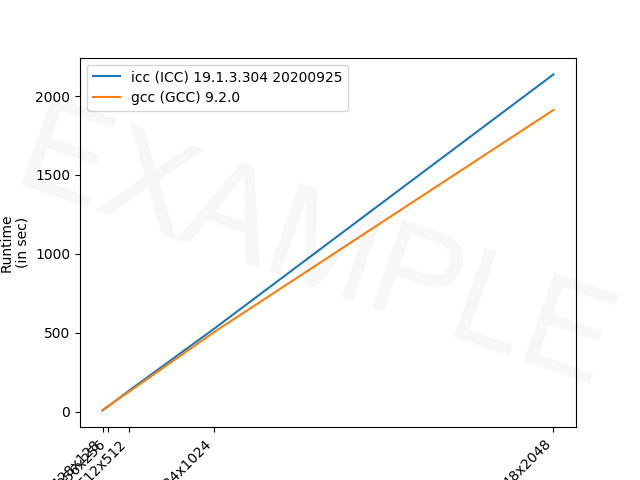

# ICE 4131 High Performance Computing - Lab 4

**Tutor:** Peter Butcher ([p.butcher@bangor.ac.uk](p.butcher@bangor.ac.uk))

**Lab Assistants**:

- Iwan Mitchell ([i.t.mitchell@bangor.ac.uk](i.t.mitchell@bangor.ac.uk))
- Frank Williams ([f.j.williams@bangor.ac.uk](f.j.williams@bangor.ac.uk))

### Objectives

_**NOTE:** If you have not completed the tasks from the [previous labs](../), you should complete those first!_

Today's lab will get you using [Pthread](https://pubs.opengroup.org/onlinepubs/7908799/xsh/pthread.h.html) to parallelise a portion of the `SimpleRayTracing` program from lab 3 with the following steps:

1. Based on the results from lab 3, first decide which compiler to use
   - We can look at the raw numbers in a spreadsheet, or...
   - We can plot the data in a graph.
2. Take a look back at the results of `gprof` to identify which portion of code to parallelise.
3. Write the corresponding code using Pthread.
4. For a given image size, run the code on the compute nodes with various numbers of threads.
5. Plot the corresponding graphs.

> To help you get started with Pthread, a live demo will be presented during this session. The recording of this demonstration will be available later on Blackboard if you miss it.

### Task List

Today's tasks are as follows:

1. [Get the latest updates to this repository](#step-1-get-the-latest-updates-to-this-repository)
2. [Choose a Compiler](#step-2-choose-a-compiler)
3. [Identify which portion of the code to parallelise](#step-3-identify-which-portion-of-the-code-to-parallelise)
4. [Set up `CMakeLists.txt` for Pthread](#step-4-set-up-cmakeliststxt-for-pthread)
5. [Parallelise this step in `main-pthreads.cxx`](#step-5-parallelise-this-step-in-main-pthreadscxx)
6. [Run on compute nodes with various numbers of threads](#step-6-run-on-compute-nodes-with-various-numbers-of-threads)

---

## STEP 1: Get the latest updates to this repository

To get the latest updates to this repository on the Supercomputer:

1. Navigate to the `ice-4131-labs` directory you created during Lab 3.

2. Stash local changes you made by typing:

```bash
git stash
```

3. Get updates from this GitHub repository:

```bash
git pull
```

4. Re-apply your changes:

```bash
git stash apply
```

5. Your copy of `ice-4131-labs` will now be up to date!

---

## STEP 2: Choose a Compiler

In Lab 3 we worked with the `SimpleRayTracing` application and created a file, `runtime.csv`. Look at the contents of this file as a spreadsheet (you may need to use [WinSCP](https://winscp.net/eng/index.php) or equivalent to download the file from the Supercomputer). There may be some errors in this file but you can delete rows that show errors before performing analysis.

Which performed better, `icc` or `g++`?

To make it absolutely certain that we make the right choice, let's plot the data in a graph with Python:

- On the Supercomputer, create a new text file called `plotRuntime.py` that contains:

```py
#!/usr/bin/env python3

import matplotlib
matplotlib.use('Agg') # Use the 'Agg' backend, which is non-GUI

import matplotlib.pyplot as plt # For plotting
import pandas as pd # Python data analysis library

# Load the spreadsheet
df = pd.read_csv("runtime.csv")

# Create a dummy column
df["nb pixels"] = None

for img_size in df["Image size"].unique():
    test = df["Image size"] == img_size

    w, h = img_size.split("x")
    df["nb pixels"][test] = int(w) * int(h)

# Sort by resolution
df = df.sort_values(by=["nb pixels"])

# Create a new figure
plt.figure()

# Plot the runtime for each compiler
for compiler in df["Compiler"].unique():
    test = df["Compiler"] == compiler
    plt.plot(df[test]["nb pixels"], df[test]["Runtime in sec"], 'o-', label=compiler)

# Add the horizontal and vertical labels
plt.xlabel("Number of pixels")
plt.ylabel("Runtime\n(in sec)")

# Get the horizontal ticks
xtics_values = []
xtics_labels = []

for res in df["nb pixels"].unique():
    test = df["nb pixels"] == res
    xtics_values.append(int(res))
    xtics_labels.append(df[test]["Image size"].values[0])

# Add the horizontal ticks
plt.xticks(xtics_values, xtics_labels, rotation=45, ha='right')

# Add the legend
plt.legend()

# Save the plot
plt.savefig('runtime-icc_vs_gcc.pdf')
plt.savefig('runtime-icc_vs_gcc.png')
```

- Load the Python module with:

```bash
module load python/3.7.0
```

- Make sure `matplotlib` and `pandas` are installed:

```bash
python3 -m pip install --user pandas matplotlib
```

- Run the `plotRuntime.py` script:

```bash
python3 plotRuntime.py
```

- Two new files have been created, `runtime-icc_vs_gcc.pdf` (for your report), and `runtime-icc_vs_gcc.png` (for a website):



- Looking at the plot, which compiler is the fastest? (Find the curve that is the flattest)
- Once you've identified the fastest compiler, you should use that from now on!
  - Make sure you call `source env-gnu.sh` or `source env-intel.sh`.

---

## STEP 3: Identify which portion of the code to parallelise

During lab 3, you generated a file called `serial-profiling.txt`.

- Open `serial-profiling.txt` on your local machine.
- Open `src/main.cxx` on your local machine too (or from GitHub).
- Using `serial-profiling.txt`, identify which part of the code of `src/main.cxx` that you must parallelise. As we discussed in the lecture, we often look for `for` loops.

---

## STEP 4: Set up `CMakeLists.txt` for Pthread

1. Edit `CMakeLists.txt` and at the end of the file add the following:

```bash
set(CMAKE_THREAD_PREFER_PTHREAD TRUE)
find_package(Threads REQUIRED)
```

This will look for the `pthread` library.

2. Add the program:

```bash
add_executable(main-pthreads src/main-pthreads.cxx)
TARGET_LINK_LIBRARIES (main-pthreads PUBLIC RayTracing ${ASSIMP_LIBRARY} Threads::Threads)
```

As shown in the code here, our source file for our `pthread` implementation is in `src/main-pthread.cxx`.

---

## STEP 5: Parallelise this step in `main-pthreads.cxx`

> **ESSENTIAL:**
>
> Compile Often
>
> You may test your code on the login node, but with only 2 threads, and a small image size, e.g. 32x32.

A small example application and the steps to parallelising it with `pthread` is available in [`lab4/pthread-example`](./pthread-example/). We will however continue editing files within `lab3/SimpleRayTracing`.

1. You should edit `src/main-pthreads.cxx`. You can copy the contents of `main.cxx` into `src/main-pthreads.cxx`.

   - Compile.
   - Test.

2. Work load allocation.

   - Define a structure to store data required by each thread. You can see an example at [lines 9-15](./pthread-example/pthread-example-step-4.cxx#L9-L15) of [`pthread-example-step-4.cxx`](./pthread-example/pthread-example-step-4.cxx).
   - In your case, the polygon meshes, the light, maybe some other parameters, and the output image have to be accessible from the thread.
     - Compile.
   - Compute the number of pixels processed by each thread. You can see an example at [lines 45-66](./pthread-example/pthread-example-step-4.cxx#L45-L66) of [`pthread-example-step-4.cxx`](./pthread-example/pthread-example-step-4.cxx).
     - Compile.
     - Test.

3. Create _T_ threads:

   - Use the `pthread_create` function.
   - See the slides from lecture 4 for an explanation
   - See an example on lines [18](./pthread-example/pthread-example-step-5.cxx#L18), [71-78](./pthread-example/pthread-example-step-5.cxx#L71-L78), and [117-121](./pthread-example/pthread-example-step-5.cxx#L117-L121) of [`pthread-example-step-5.cxx`](./pthread-example/pthread-example-step-5.cxx).
   - Compile.

4. Wait for all threads to complete before saving the output image into a file.

   - Use the `pthread_join` function.
   - See the slides from week 4 for an explanation
   - See an example on lines [80-84](./pthread-example/pthread-example-step-6.cxx#L80-L84) of [`pthread-example-step-6.cxx`](./pthread-example/pthread-example-step-6.cxx).
   - Compile.

5. Write the callback
   - The lines of code corresponding to the most computationally intensive task has to be ported to the callback function.
   - See an example on lines [15-16](./pthread-example/pthread-example-step-7.cxx#L15-L16), [34-36](./pthread-example/pthread-example-step-7.cxx#L34-L36), [51](./pthread-example/pthread-example-step-7.cxx#L51), [63-64](./pthread-example/pthread-example-step-7.cxx#L63-L64), [91-96](./pthread-example/pthread-example-step-7.cxx#L91-L96), and [127-142](./pthread-example/pthread-example-step-7.cxx#L127-L142) of [`pthread-example-step-7.cxx`](./pthread-example/pthread-example-step-7.cxx).

---

## STEP 6: Run on compute nodes with various numbers of threads

There is a script inside [`lab3/SimpleRayTracing`](../lab3/SimpleRayTracing/submit-pthread.sh) that submits jobs with various numbers of threads. You'll need to update it:

1. Input your email address at line 11.

2. By default, `g++` is enabled. If you want to use the Intel compiler, change `env-gnu.sh` on line 34 into `env-intel.sh`, and uncomment line 40.

3. Run the script using:

```bash
./submit-pthread.sh
```

This will submit **10** jobs.

Once these jobs are completed, you can modify `plotRuntime.py` to plot more data.

**This concludes lab 4**
