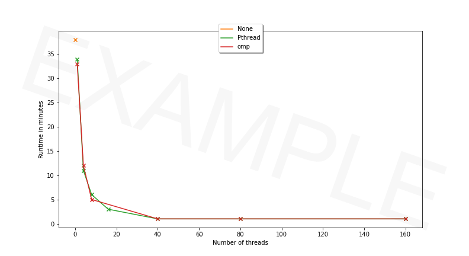
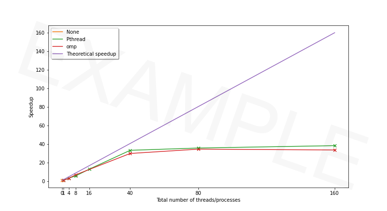

# ICE 4131 High Performance Computing - Lab 5

**Tutor:** Peter Butcher ([p.butcher@bangor.ac.uk](p.butcher@bangor.ac.uk))

**Lab Assistants**:

- Iwan Mitchell ([i.t.mitchell@bangor.ac.uk](i.t.mitchell@bangor.ac.uk))
- Frank Williams ([f.j.williams@bangor.ac.uk](f.j.williams@bangor.ac.uk))

### Objectives

_**NOTE:** If you have not completed the tasks from the [previous labs](../), you should complete those first!_

Today's lab will get you using [OpenMP](https://www.openmp.org/) to parallelise the `SimpleRayTracing` program from lab 3, comparing performance results to that of your parallelised Pthread implementation from lab 4. The broad steps we will follow are:

1. Plot the results of Pthread performance (for comparison later)
2. Parallelise serial code using OpenMP (i.e. adding OpenMP pragmas)

- The serial code for `SimpleRayTracing` is available in `src/main.cxx`
- Write your OpenMP code in `src/main-omp.cxx`

3. Run the code on the compute nodes of Supercomputing Wales

### Task List

Today's tasks are as follows:

1. [Get the latest updates to this repository](#step-1-get-the-latest-updates-to-this-repository)
2. [Plot the Results of Pthread Performance](#step-2-plot-the-results-of-pthread-performance)
3. [Set Up Your Module Environment for OpenMP](#step-3-set-up-your-module-environment-for-openmp)
4. [Parallelise Code Using OpenMP](#step-4-parallelise-code-using-openmp)
5. [Evaluate the Performance of OpenMP](#step-5-evaluate-the-performance-of-openmp)

---

## STEP 1: Get the latest updates to this repository

To get the latest updates to this repository on the Supercomputer:

1. Navigate to the `ice-4131-labs` directory you created during Lab 3.

2. Stash local changes you made by typing:

```bash
git stash
```

3. Get updates from this GitHub repository:

```bash
git pull
```

4. Re-apply your changes:

```bash
git stash apply
```

5. Your copy of `ice-4131-labs` will now be up to date!

---

## STEP 2: Plot the Results of Pthread Performance

Assuming that all the jobs in `lab4` completed successfully, run:

```bash
cat timing.csv timing-serial-intel-*.csv timing-serial-gnu-*.csv timing-pthread-*.csv > runtime.csv
```

- Download `runtime.csv` using your preferred SFTP client, e.g. WinSCP.
- Open the file using Microsoft Excel or equivalent.
- Check if the content looks OK (i.e. no corrupted content).
- Create a new text file called `plotPthread.py` that contains:

```python
#!/usr/bin/env python3

import matplotlib.pyplot as plt # Plotting library
import pandas as pd # Load the CSV file

# Load the spreadsheet
df = pd.read_csv("runtime.csv")

# Sort by number of threads
df = df.sort_values(by=["Number of threads/processes per node"])

# Consider the runs corresponding to Pthread
test_pthread = df["Parallelisation"] == "Pthread"

# Find the resolution that was used the most
resolution = None
resolution_count = 0
for res in df[test_pthread]["Image size"].unique():
    test = df["Image size"] == res
    count = df[test_pthread & test]["Image size"].count()
    if resolution_count < count:
        resolution_count = count
        resolution = res

# Find the image width and image height
width = int(resolution.split('x')[0])
height = int(resolution.split('x')[1])

# Create a new figure
plt.figure()

# Select the rows corresponding to Pthread and the right image resolution
test_res = df["Image size"] == resolution
test = test_res & test_pthread

# Plot the data in min
plt.plot(df[test]["Number of threads/processes per node"],
         df[test]["Runtime in sec"]/60,
         "o-",
         label="Pthread")

# Add the horizontal and vertical labels
plt.xlabel("Number of threads")
plt.ylabel("Runtime\n(in min)")

# Add the legend
plt.legend()

# Save the plot
plt.savefig('runtime-pthread.pdf')
plt.savefig('runtime-pthread.png')

# Create a new figure
plt.figure()

# Select the rows corresponding to the serial code and of the right image resolution
test_serial = df["Parallelisation"] == "None"
print(df[test_serial & test_res])
serial_runtime = df[test_serial & test_res]["Runtime in sec"].min()

# Plot the speedup factors
plt.plot(df[test]["Number of threads/processes per node"],
         serial_runtime / df[test]["Runtime in sec"],
         "o-",
         label="Pthread")

# Add the horizontal and vertical labels
plt.xlabel("Number of threads")
plt.ylabel("Speedup factor")

# Add the legend
plt.legend()

# Save the plot
plt.savefig('speedup-pthread.pdf')
plt.savefig('speedup-pthread.png')
```

Follow the instructions from last time to load the Python modules and to run the script to produce the following output:

### Runtime with Pthread



### Speedup with Pthread



---

## STEP 3: Set Up Your Module Environment for OpenMP

1. Reuse `env-gnu.sh` from `lab3`. It is used to load modules. You need the following modules:

- cmake
- gnuplot
- gcc 9.2.0

> **ESSENTIAL:** You need to run `env-gnu.sh` every time you log in to ensure the correct modules are loaded.

If you can't remember where `env-gnu.sh` is, run the following command to locate where it is:

```bash
find ~ -name env-gnu.sh
```

Navigate to where the file is located and load the modules using:

```bash
source env-gnu.sh
```

2. To check that the modules are loaded, use:

```bash
module list
```

---

## STEP 4: Parallelise Code Using OpenMP

Copy/Paste the content of `src/main.cxx` into `src/main-omp.cxx`.

### Single for loops

A typical for loop looks like:

```cxx
for (int i = 0; i < N; i++) {
  ...
}
```

To parallelise it using OpenMP, a compiler directive (pragma) has to be specified using `#pragma`:

```cxx
#pragma omp parallel for
for (int i = 0; i < N; i++) {
  ...
}
```

In this case, the number of threads is automatically detected at runtime. It will correspond to the number of CPU cores available on the system.

If you want to control the number of threads yourself, add the `num_threads` clause:

```cxx
#pragma omp parallel for num_threads(M)
for (int i = 0; i < N; i++) {
  ...
}
```

where `M` is the number of threads. You will need to use this approach if you want to assess the behaviour of the program depending on the number of threads.

Alternatively, you can use an environment variable: `OMP_NUM_THREADS`. For example, if you type `export OMP_NUM_THREADS=16;` before executing your OpenMP code, 16 threads will be used.

## Nested loops

Sometimes, we have nested loops:

```cxx
for (int j = 0; j < height; j++) {
  for (int i = 0; i < width; i++) {
    ...
  }
}
```

The OpenMP `collapse` clause can be used to parallelise nested loops:

```cxx
#pragma omp parallel for collapse(2)
for (j = 0; j < height; j++) {
  for (i = 0; i < width; i++) {
    ...
  }
}
```

In `collapse(2)`, `2` is used because we have two nested loops.

The OpenMP collapse clause will increase the number of iterations per thread. It will reduce the granularity of work to be done by each thread, which may improve performance.

## Add OpenMP Pragmas

1. Add the appropriate OpenMP pragmas in `main-omp.cxx`.

2. You must enable the `-fopenmp` option of the compiler. If you don't, the pragmas will be ignored by the compiler.

Update `CMakeLists.txt` with:

```cmake
# OpenMP ################################################################
find_package(OpenMP REQUIRED)

# Program ###############################################################
add_executable(main-omp src/main-omp.cxx)
TARGET_INCLUDE_DIRECTORIES(main-omp PUBLIC ${ASSIMP_INCLUDE_DIRS})
TARGET_LINK_LIBRARIES (main-omp PUBLIC RayTracing ${ASSIMP_LIBRARY})
if(OpenMP_CXX_FOUND)
    TARGET_LINK_LIBRARIES(main-omp PUBLIC OpenMP::OpenMP_CXX)
endif()
```

3. Compile your code.

## Run Your Program

To run your program:

1. Launch a job using SLURM. Do not run it directly on `hawklogin.cf.ac.uk`. Be considerate to other users, this is a shared resource!

2. See `lab2` for an explanation.

3. A script is provided: [`submit-omp.sh`](../lab3/SimpleRayTracing/submit-omp.sh).

You can edit `submit-omp.sh` to use your email address in `echo ##SBATCH --mail-user=YOUREMAILADDRESS@bangor.ac.uk`. (Remove one of the leading `#`s.)

`submit-omp.sh` creates another 8 scripts, `submit-omp-*.sh` which submits the jobs with 1, 4, 8, 16, 24, 40, 80 and 160 threads. For example, the script below (`submit-omp-40.sh`) is the script used to submit a job with 40 threads.

```bash
#!/usr/bin/env bash
#
#SBATCH -A scw1563                   # Project/Account (use your own)
##SBATCH --mail-user=YOUREMAILADDRESS@bangor.ac.uk # Where to send mail
#SBATCH --mail-type=END,FAIL         # Mail events (NONE, BEGIN, END, FAIL, ALL)
#SBATCH --job-name=RT-40-omp         # Job name
#SBATCH --output ray_tracing-%j.out  #
#SBATCH --error ray_tracing-%j.err   #
#SBATCH --nodes=1                    # Use one node
#SBATCH --ntasks-per-node=1          # Number of tasks per node
#SBATCH --cpus-per-task=40           # Number of cores per task
#SBATCH --time=00:25:00              # Time limit hrs:min:sec
#SBATCH --mem=600mb                  # Total memory limit
thread_number=40
module purge > /dev/null 2>&1
module load cmake mpi/intel
COMPILER="icc (ICC) 18.0.2 20180210"
TEMP=`lscpu|grep "Model name:"`
IFS=':' read -ra CPU_MODEL <<< "$TEMP"
width=2048
height=2048
echo Run ./main-omp with 40 threads.
export OMP_NUM_THREADS=40
/usr/bin/time --format='%e' ./bin-release-gcc/main-omp --size 2048 2048 --jpeg omp-40-2048x2048.jpg 2> temp-omp-40
RUNTIME=`cat temp-omp-40`
echo ${CPU_MODEL[1]},omp,$thread_number,1,$COMPILER,${width}x$height,$RUNTIME >> timing-omp-40.csv
#rm temp-omp-40
```

4. To launch the job, use:

```bash
./submit-omp.sh
```

5. Wait for the job to complete. Use `squeue -u $USER`.

6. When the job is terminated, you'll have new files. Examine their content. Are the JPEG files as expected?

7. To see the new images, download them from `hawklogin.cf.ac.uk` to your PC using WinSCP.

8. Only go to the next section when everything works as expected. If not, debug your code.

---

## STEP 5: Evaluate the Performance of OpenMP

Using the same method as before, update runtime.csv

```bash
cat timing-omp-*.csv >> runtime.csv
```

- Copy `plotPthread.py` into a new script `plotPthreadVsOpenMP.py`.
- Update the script to plot two curves, one for Pthread, one for OpenMP.

### Next Time

We'll use more than one node at a time using MPI (Message Passing Interface). For example, with 8 nodes, it takes only 12 seconds to compute the whole 2048x2048 image. Yes, 12 seconds. The serial code takes 45 minutes. That's a speed up of 225x.

**This concludes lab 3**
