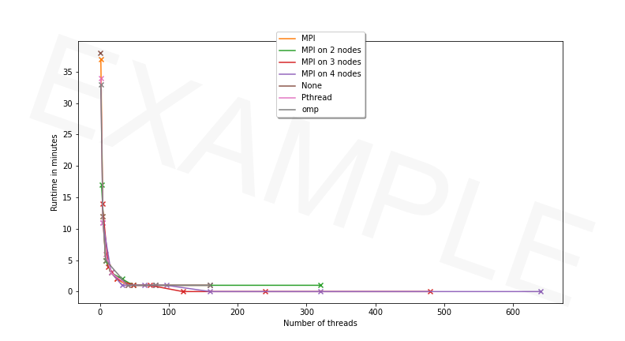
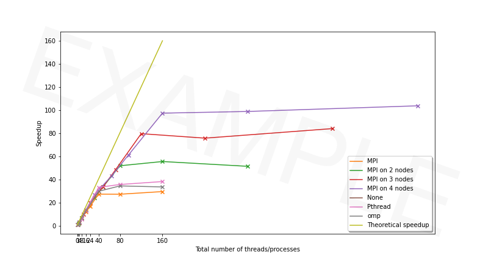

# ICE 4131 High Performance Computing - Lab 6

**Tutor:** Peter Butcher ([p.butcher@bangor.ac.uk](p.butcher@bangor.ac.uk))

**Lab Assistants**:

- Iwan Mitchell ([i.t.mitchell@bangor.ac.uk](i.t.mitchell@bangor.ac.uk))
- Frank Williams ([f.j.williams@bangor.ac.uk](f.j.williams@bangor.ac.uk))

### Objectives

_**NOTE:** If you have not completed the tasks from the [previous labs](../), you should complete those first!_

Today's lab will give you an introduction to splitting work across multiple nodes on the Supercomputer. Until now we have been dividing work up to run on multiple threads on a _single_ node. To make full use of the computing power we have available, we need to be able to use more than one node at a time. We'll achieve this increased parallelisation with the Message Passing Interface ([MPI](https://www.open-mpi.org/)). Here's what we'll do in this lab:

1. Parallelise some serial code using MPI.
2. Run the code on multiple compute nodes
3. Plot graphs of runtimes and speedups to compare between serial code, Pthread, OpenMP and MPI.

We will continue using the [SimpleRayTracing](../lab3/SimpleRayTracing/) code provided for you in [lab 3](../lab3/).

- The serial code for `SimpleRayTracing` is available in `src/main.cxx`
- Add your code to `main-mpi.cxx`

### Task List

Today's tasks are as follows:

1. [Get the latest updates to this repository](#step-1-get-the-latest-updates-to-this-repository)
2. [Setup Our Environment for MPI](#step-2-setup-our-environment-for-mpi)
3. [Plot the Results of OpenMP Performance](#step-3-plot-the-results-of-openmp-performance)
4. [Update `CMakeLists.txt` for MPI](#step-4-update-cmakeliststxt-for-mpi)
5. [Parallelise Code with MPI](#step-5-parallelise-code-with-mpi)
6. [Run Your Program](#step-6-run-your-program)
7. [Full Performance Evaluation](#step-7-full-performance-evaluation)

---

## STEP 1: Get the latest updates to this repository

To get the latest updates to this repository on the Supercomputer:

1. Navigate to the `ice-4131-labs` directory you created during Lab 3.

2. Stash local changes you made by typing:

```bash
git stash
```

3. Get updates from this GitHub repository:

```bash
git pull
```

4. Re-apply your changes:

```bash
git stash apply
```

5. Your copy of `ice-4131-labs` will now be up to date!

---

## STEP 2: Setup Our Environment for MPI

1. To begin using MPI, we first need to figure out which MPI implementations are available to us:

```bash
module available mpi
```

2. Next, edit `env-gnu.sh` and load an MPI implementation, e.g. OpenMPI.

3. Load the file and setup the environment with:

```bash
source env-gnu.sh
```

4. Check that the modules are loaded with:

```bash
module list
```

---

## STEP 3: Plot the Results of OpenMP Performance

Assuming that all the jobs in `lab5` completed successfully, copy `plotPthread.py` to `plotPthreadOpenMP.py` and modify the file to plot:

- Runtimes of both the Pthread and OpenMP implementations
- Speed-ups of both the Pthread and OpenMP implementations

> If you get stuck on this step, move on, we will plot this information again later.

---

### STEP 4: Update `CMakeLists.txt` for MPI

Edit `CMakeLists.txt`:

1. Look for MPI

```cmake
find_package(MPI REQUIRED)
```

2. Add the new executable

```cmake
add_executable(main-mpi src/main-mpi.cxx)
```

3. Specify extra header directories

```cmake
TARGET_INCLUDE_DIRECTORIES(main-mpi PUBLIC ${ASSIMP_INCLUDE_DIRS} ${MPI_INCLUDE_PATH})
```

4. Link libraries

```cmake
TARGET_LINK_LIBRARIES (main-mpi PUBLIC RayTracing ${ASSIMP_LIBRARY} ${MPI_CXX_LIBRARIES})
```

---

### STEP 5: Parallelise Code with MPI

If you haven't already done so, copy the contents of `main.cxx` into `main-mpi.cxx`.

1. Add the MPI header, `<mpi.h>`.

2. Initialise MPI at the beginning of the main method:

```cpp
// Initialise MPI
MPI_Init(NULL, NULL)
```

3. Finalise MPI at the end of the main method, before it exits:

```cpp
// Finalise MPI
MPI_Finalize()
```

4. Save the final image:

Several processes, potentially running on different computers, will collaborate to generate a single image. Each process will work on a small portion of the whole image. Only one of them can write the final image to disk, the ROOT. You must define a constant global variable `ROOT`, equal to rank 0 (the process with ID 0):

```cpp
const int ROOT = 0
```

In the `main` method, find where the final image is saved. Make sure only the `ROOT` will write it:

```cpp
// Only the leader is allowed to save
if (rank == ROOT) {
  output_image.saveJPEGFile(output_file_name);
}
```

This will ensure other processes will not write the file to disk.

5. Compile your code

6. Workload allocation

From now on, the only function we will modify is `renderLoop`. The workload allocation is the same as we saw with Pthread. Instead of threads however, we are now dealing with processes. The total number of processes is the world size:

```cpp
int world_size;
MPI_Comm_size(MPI_COMM_WORLD, &world_size);
```

The rank (process ID) of the process is retrieved as follows:

```cpp
int rank;
MPI_Comm_rank(MPI_COMM_WORLD, &rank);
```

Each process deals with `elements_per_task` (number of pixels):

```cpp
unsigned int number_of_pixels = anOutputImage.getWidth() * anOutputImage.getHeight();
unsigned int elements_per_task = number_of_pixels / world_size;
unsigned int remainder = number_of_pixels % world_size;
```

Each process must know the index of the first and last pixels it must compute:

```cpp
int start_id = 0;
int end_id = number_of_pixels - 1;
int last_element = -1;

for (int i = 0; i < world_size; ++i) {
  start_id = ++last_element;
  end_id = last_element + elements_per_task - 1;

  // Distribute the remaining pixels
  if (remainder > 0) {
    end_id++;
    --remainder;
  }

  last_element = end_id;

  // Exit the method
  if (rank == i) break;
}
```

Note that if the number of pixels (`number_of_pixels`) does not divide equally between the number of processors (`world_size`), the remaining pixels (`remainder`) is shared between processes to ensure no pixels are missing in the final image.

7. Compile your code.

8. Rendering loop

The 2 nested rendering loops must be replaced with a single loop to process the pixels from `start_id` to `end_id`. The 2D pixel coordinates are computed from the 1D pixel coordinates:

```cpp
for (unsigned int id = start_id; id <= end_id; ++id) {
  int row = id / anOutputImage.getWidth();
  int col = id % anOutputImage.getWidth();

  // ...
}
```

9. Compile your code.

10. Gathering the data from all the processes

If you used 4 processes, the `ROOT` only knows about the top quarter of the image. At the end of the `renderLoop` function it must collect the other 3 quarters from the other processes. These processes may actually be executed on another computer/node:

```cpp
// Leader gathers results from all the processes
if (rank == ROOT) {
  for (int i = 1; i < world_size; ++i) {
    int start_id;
    int end_id;

    MPI_Status status;

    checkMPIError(MPI_Recv(&start_id, 1, MPI_INT, i, 0, MPI_COMM_WORLD, &status));
    checkMPIError(MPI_Recv(&end_id, 1, MPI_INT, i, 1, MPI_COMM_WORLD, &status));
    checkMPIError(MPI_Recv(anOutputImage.getData() + start_id * 3, (end_id - start_id + 1) * 3, MPI_UNSIGNED_CHAR, i, 2, MPI_COMM_WORLD, &status));
  }
}
// Other processes (followers) send the data to the leader
else {
  checkMPIError(MPI_Send(&start_id, 1, MPI_INT, ROOT, 0, MPI_COMM_WORLD));
  checkMPIError(MPI_Send(&end_id,   1, MPI_INT, ROOT, 1, MPI_COMM_WORLD));
  checkMPIError(MPI_Send(anOutputImage.getData() + start_id * 3, (end_id - start_id + 1) * 3, MPI_UNSIGNED_CHAR, ROOT, 2, MPI_COMM_WORLD));
}
```

Now you need the code for `checkMPIError`, which makes sure `MPI_Recv` and `MPI_Send` executed without errors:

```cpp
void checkMPIError(int errorCode) {
  if (errorCode == MPI_ERR_COMM) {
    throw "Invalid communicator. A common error is to use a null communicator in a call (not even allowed in MPI_Comm_rank).";
  } else if (errorCode == MPI_ERR_TYPE) {
    throw "Invalid datatype argument. Additionally, this error can occur if an uncommitted MPI_Datatype (see MPI_Type_commit) is used in a communication call.";
  } else if (errorCode == MPI_ERR_COUNT) {
    throw "Invalid count argument. Count arguments must be non-negative; a count of zero is often valid.";
  } else if (errorCode == MPI_ERR_TAG) {
    throw "Invalid tag argument. Tags must be non-negative; tags in a receive (MPI_Recv, MPI_Irecv, MPI_Sendrecv, etc.) may also be MPI_ANY_TAG. The largest tag value is available through the the attribute MPI_TAG_UB.";
  } else if (errorCode == MPI_ERR_RANK) {
    throw "Invalid source or destination rank. Ranks must be between zero and the size of the communicator minus one; ranks in a receive (MPI_Recv, MPI_Irecv, MPI_Sendrecv, etc.) may also be MPI_ANY_SOURCE. ";
  }
}
```

11. Compile your code.

---

### STEP 6: Run Your Program

1. To run your program, launch a job. **DO NOT RUN IT DIRECTLY ON `hawklogin.cf.ac.uk`**. Be considerate to other users, this is a shared resource.

2. See [Lab 2](../lab2/) for an explanation.

3. A script is provided for your convenience, [`submit-mpi.sh`](../lab3/SimpleRayTracing/submit-mpi.sh). Edit this file to use your project code and email address as before.

`submit-mpi.sh` creates another 4*8=32 scripts named `submit-mpi-*-\*.sh` and submits the jobs with 1, 2, 3, and 4 nodes with 1, 4, 8, 16, 24, 40, 80 and 160 processes on each node.

For example, the script below `submit-mpi-4-40.sh` is the script used to submit a job with 40 processes on 4 nodes, i.e. a total of 160 processes.

```bash
#!/usr/bin/env bash
#
#SBATCH -A scw2139                   # Project/Account (use your own)
##SBATCH --mail-user=YOUREMAILADDRESS@bangor.ac.uk  # Where to send mail
#SBATCH --mail-type=END,FAIL         # Mail events (NONE, BEGIN, END, FAIL, ALL)
#SBATCH --job-name=RT-4-40-MPI       # Job name
#SBATCH --output ray_tracing-%j.out  #
#SBATCH --error ray_tracing-%j.err   #
#SBATCH --nodes=4                    # Use one node
#SBATCH --cpus-per-task=1            # Number of cores per task
#SBATCH --ntasks-per-node=40         # Number of tasks per node
#SBATCH --time=00:25:00              # Time limit hrs:min:sec
#SBATCH --mem=600mb                  # Total memory limit
process_number=40
module purge > /dev/null 2>&1
module load cmake mpi/intel
COMPILER="gcc (GCC) 4.8.5 20150623 (Red Hat 4.8.5-39)"
COMPILER="icc (ICC) 18.0.2 20180210"
TEMP=`lscpu|grep "Model name:"`
IFS=':' read -ra CPU_MODEL <<< "$TEMP"
width=2048
height=2048
echo Run ./main-mpi with 40 processes.
/usr/bin/time --format='%e' mpirun  ./bin-release-gcc/main-mpi --size 2048 2048 --jpeg mpi-4-40-2048x2048.jpg 2> temp-mpi-4-40
RUNTIME=`cat temp-mpi-4-40`
echo ${CPU_MODEL[1]},MPI,$process_number,4,$COMPILER,${width}x$height,$RUNTIME >> timing-mpi-4-40.csv
#rm temp-mpi-4-40
```

4. To launch `submit-mpi.sh` use:

```bash
./submit-mpi.sh
```

5. Wait for the job to complete. Use:

```bash
squeue -u $USER
```

6. When the job is terminated you will have new files. Examine their content. Are the JPEG files as expected?

7. To see the new images, download them from the Supercomputer to your PC.

Only proceed to the next step when everything works as expected. If not, debug your code or seek assistance.

---

### STEP 7: Full Performance Evaluation

1. A shell script, [`createTiming.sh`](../lab3/SimpleRayTracing/createTiming.sh) is provided for your own convenience. It will concatenate the runtimes for all jobs that completed using serial, Pthread, OpenMP, and MPI. It creates a spreadsheet: `timing.csv`.

Below is an example of the output that could be obtained from SCW:

| CPU                                      | Parallelisation | Number of threads/processes per node | Number of nodes | Compiler                  | Image size | Runtime in sec |
| ---------------------------------------- | --------------- | ------------------------------------ | --------------- | ------------------------- | ---------- | -------------- |
| Intel(R) Xeon(R) Gold 6148 CPU @ 2.40GHz | None            | 0                                    | 1               | icc (ICC) 18.0.2 20180210 | 2048x2048  | 2264.58        |
| Intel(R) Xeon(R) Gold 6148 CPU @ 2.40GHz | Pthread         | 160                                  | 1               | icc (ICC) 18.0.2 20180210 | 2048x2048  | 58.96          |
| Intel(R) Xeon(R) Gold 6148 CPU @ 2.40GHz | Pthread         | 16                                   | 1               | icc (ICC) 18.0.2 20180210 | 2048x2048  | 172.76         |
| Intel(R) Xeon(R) Gold 6148 CPU @ 2.40GHz | Pthread         | 1                                    | 1               | icc (ICC) 18.0.2 20180210 | 2048x2048  | 2066.42        |
| Intel(R) Xeon(R) Gold 6148 CPU @ 2.40GHz | Pthread         | 40                                   | 1               | icc (ICC) 18.0.2 20180210 | 2048x2048  | 67.8           |
| Intel(R) Xeon(R) Gold 6148 CPU @ 2.40GHz | Pthread         | 4                                    | 1               | icc (ICC) 18.0.2 20180210 | 2048x2048  | 650.46         |
| Intel(R) Xeon(R) Gold 6148 CPU @ 2.40GHz | Pthread         | 80                                   | 1               | icc (ICC) 18.0.2 20180210 | 2048x2048  | 63.14          |
| Intel(R) Xeon(R) Gold 6148 CPU @ 2.40GHz | Pthread         | 8                                    | 1               | icc (ICC) 18.0.2 20180210 | 2048x2048  | 389.77         |
| Intel(R) Xeon(R) Gold 6148 CPU @ 2.40GHz | omp             | 160                                  | 1               | icc (ICC) 18.0.2 20180210 | 2048x2048  | 67.07          |
| Intel(R) Xeon(R) Gold 6148 CPU @ 2.40GHz | omp             | 1                                    | 1               | icc (ICC) 18.0.2 20180210 | 2048x2048  | 1976.59        |
| Intel(R) Xeon(R) Gold 6148 CPU @ 2.40GHz | omp             | 40                                   | 1               | icc (ICC) 18.0.2 20180210 | 2048x2048  | 75.5           |
| Intel(R) Xeon(R) Gold 6148 CPU @ 2.40GHz | omp             | 4                                    | 1               | icc (ICC) 18.0.2 20180210 | 2048x2048  | 693.33         |
| Intel(R) Xeon(R) Gold 6148 CPU @ 2.40GHz | omp             | 80                                   | 1               | icc (ICC) 18.0.2 20180210 | 2048x2048  | 65.35          |
| Intel(R) Xeon(R) Gold 6148 CPU @ 2.40GHz | omp             | 8                                    | 1               | icc (ICC) 18.0.2 20180210 | 2048x2048  | 321.3          |
| Intel(R) Xeon(R) Gold 6148 CPU @ 2.40GHz | MPI             | 1                                    | 1               | icc (ICC) 18.0.2 20180210 | 2048x2048  | 2202.38        |
| Intel(R) Xeon(R) Gold 6148 CPU @ 2.40GHz | MPI             | 4                                    | 1               | icc (ICC) 18.0.2 20180210 | 2048x2048  | 720.06         |
| Intel(R) Xeon(R) Gold 6148 CPU @ 2.40GHz | MPI             | 8                                    | 1               | icc (ICC) 18.0.2 20180210 | 2048x2048  | 325.67         |
| Intel(R) Xeon(R) Gold 6148 CPU @ 2.40GHz | MPI             | 16                                   | 1               | icc (ICC) 18.0.2 20180210 | 2048x2048  | 186.73         |
| Intel(R) Xeon(R) Gold 6148 CPU @ 2.40GHz | MPI             | 24                                   | 1               | icc (ICC) 18.0.2 20180210 | 2048x2048  | 132.65         |
| Intel(R) Xeon(R) Gold 6148 CPU @ 2.40GHz | MPI             | 40                                   | 1               | icc (ICC) 18.0.2 20180210 | 2048x2048  | 82.22          |
| Intel(R) Xeon(R) Gold 6148 CPU @ 2.40GHz | MPI             | 80                                   | 1               | icc (ICC) 18.0.2 20180210 | 2048x2048  | 82.47          |
| Intel(R) Xeon(R) Gold 6148 CPU @ 2.40GHz | MPI             | 160                                  | 1               | icc (ICC) 18.0.2 20180210 | 2048x2048  | 76.11          |
| Intel(R) Xeon(R) Gold 6148 CPU @ 2.40GHz | MPI             | 1                                    | 2               | icc (ICC) 18.0.2 20180210 | 2048x2048  | 1036.4         |
| Intel(R) Xeon(R) Gold 6148 CPU @ 2.40GHz | MPI             | 4                                    | 2               | icc (ICC) 18.0.2 20180210 | 2048x2048  | 324.78         |
| Intel(R) Xeon(R) Gold 6148 CPU @ 2.40GHz | MPI             | 8                                    | 2               | icc (ICC) 18.0.2 20180210 | 2048x2048  | 165.93         |
| Intel(R) Xeon(R) Gold 6148 CPU @ 2.40GHz | MPI             | 16                                   | 2               | icc (ICC) 18.0.2 20180210 | 2048x2048  | 92.71          |
| Intel(R) Xeon(R) Gold 6148 CPU @ 2.40GHz | MPI             | 24                                   | 2               | icc (ICC) 18.0.2 20180210 | 2048x2048  | 67.1           |
| Intel(R) Xeon(R) Gold 6148 CPU @ 2.40GHz | MPI             | 40                                   | 2               | icc (ICC) 18.0.2 20180210 | 2048x2048  | 43.51          |
| Intel(R) Xeon(R) Gold 6148 CPU @ 2.40GHz | MPI             | 80                                   | 2               | icc (ICC) 18.0.2 20180210 | 2048x2048  | 40.65          |
| Intel(R) Xeon(R) Gold 6148 CPU @ 2.40GHz | MPI             | 160                                  | 2               | icc (ICC) 18.0.2 20180210 | 2048x2048  | 43.91          |
| Intel(R) Xeon(R) Gold 6148 CPU @ 2.40GHz | MPI             | 1                                    | 3               | icc (ICC) 18.0.2 20180210 | 2048x2048  | 834.56         |
| Intel(R) Xeon(R) Gold 6148 CPU @ 2.40GHz | MPI             | 4                                    | 3               | icc (ICC) 18.0.2 20180210 | 2048x2048  | 220.49         |
| Intel(R) Xeon(R) Gold 6148 CPU @ 2.40GHz | MPI             | 8                                    | 3               | icc (ICC) 18.0.2 20180210 | 2048x2048  | 111.41         |
| Intel(R) Xeon(R) Gold 6148 CPU @ 2.40GHz | MPI             | 16                                   | 3               | icc (ICC) 18.0.2 20180210 | 2048x2048  | 67.3           |
| Intel(R) Xeon(R) Gold 6148 CPU @ 2.40GHz | MPI             | 24                                   | 3               | icc (ICC) 18.0.2 20180210 | 2048x2048  | 46.46          |
| Intel(R) Xeon(R) Gold 6148 CPU @ 2.40GHz | MPI             | 40                                   | 3               | icc (ICC) 18.0.2 20180210 | 2048x2048  | 28.39          |
| Intel(R) Xeon(R) Gold 6148 CPU @ 2.40GHz | MPI             | 80                                   | 3               | icc (ICC) 18.0.2 20180210 | 2048x2048  | 29.84          |
| Intel(R) Xeon(R) Gold 6148 CPU @ 2.40GHz | MPI             | 160                                  | 3               | icc (ICC) 18.0.2 20180210 | 2048x2048  | 26.91          |
| Intel(R) Xeon(R) Gold 6148 CPU @ 2.40GHz | MPI             | 1                                    | 4               | icc (ICC) 18.0.2 20180210 | 2048x2048  | 644.83         |
| Intel(R) Xeon(R) Gold 6148 CPU @ 2.40GHz | MPI             | 4                                    | 4               | icc (ICC) 18.0.2 20180210 | 2048x2048  | 166.67         |
| Intel(R) Xeon(R) Gold 6148 CPU @ 2.40GHz | MPI             | 8                                    | 4               | icc (ICC) 18.0.2 20180210 | 2048x2048  | 83.67          |
| Intel(R) Xeon(R) Gold 6148 CPU @ 2.40GHz | MPI             | 16                                   | 4               | icc (ICC) 18.0.2 20180210 | 2048x2048  | 52.54          |
| Intel(R) Xeon(R) Gold 6148 CPU @ 2.40GHz | MPI             | 24                                   | 4               | icc (ICC) 18.0.2 20180210 | 2048x2048  | 36.93          |
| Intel(R) Xeon(R) Gold 6148 CPU @ 2.40GHz | MPI             | 40                                   | 4               | icc (ICC) 18.0.2 20180210 | 2048x2048  | 23.23          |
| Intel(R) Xeon(R) Gold 6148 CPU @ 2.40GHz | MPI             | 80                                   | 4               | icc (ICC) 18.0.2 20180210 | 2048x2048  | 22.89          |
| Intel(R) Xeon(R) Gold 6148 CPU @ 2.40GHz | MPI             | 160                                  | 4               | icc (ICC) 18.0.2 20180210 | 2048x2048  | 21.81          |

2. Plot the results using Python3 and matplotlib using the [`plotTiming.py`](../lab3/SimpleRayTracing/plotTiming.py) script provided:

```bash
module load python/3.7.0
python3 -m pip install numpy pandas matplotlib
python3 plotTiming.py
```

This will create four files:

- `runtimes.pdf`
- `runtimes.png`
- `speedup.pdf`
- `speedup.png`

Example expected outputs are as follows:

- Runtimes:



- Speedup:



- What can you conclude from these graphs? Compare the relative speedup provided by both APIs.
- Can you see that processes are heavier than threads?

**This concludes lab 6**
